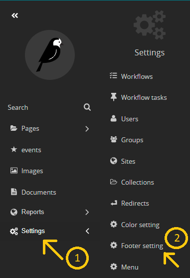

# adding footer to your website 

1- go to the settings from the side navbar 

2- select footer setting 

3- you can see now a drop down list in the top corner of the screen that have a default value of your main website

4- from that drop down list select the website you want to add information to its footer

5- fill the required fields 

- in social media you can add the type of social media and the link 
    
- in the google maps location you can put the name of area in the title then put the link of the location in the URL

6- save 

<h4 style="color:red">important notes</h4>

- check [this doc](documents/localization.md#steps-to-translate-a-footer) to add transition into footer.

  
  

now you can find changes reflected in your website :D 

