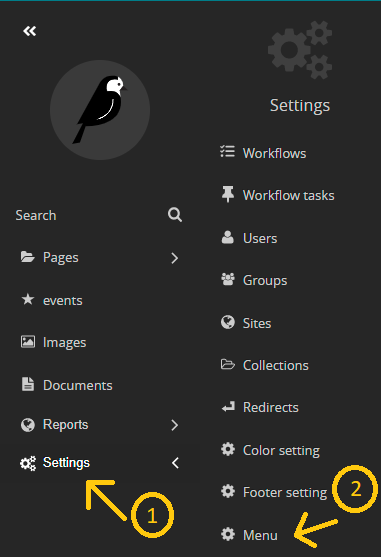
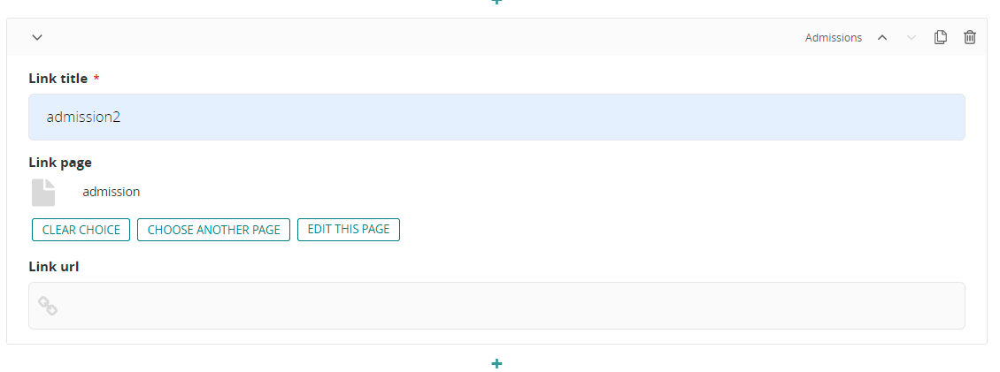

# adding navbar information

1- go to the seeting in the side navbar

2- go to menu

3- in the menu page you can find a drop down list in the right to corner of the page , this have a default value of your main website

4- fron that drop down list choose the website that you want to add information to 

5- fill the required field

- choose a logo
- you can see that the fields reqiures you to choose a page (to show it in the navbar) so 

    - click on choose page button.

    - if you want a child page from a website click on the right arrow 
    

    - choose the page you want to attach (here for example contact page) 
    
    
- at the end of the page you can find a (+) sympol this is to add a subpages from the parent page, to make a drop down list in the navbar. (for example: Admission page has subpages inside it as a child pages). 

    - choose the field that you want to make a drop down list from eg:schools

    - add the infromation that you like 

    - if you want to add another drop down item for the sam field eg: adding 3 or 4 schools to school , you can press on the + sympol again and choose school again...etc

6- save  

### notes:
*these links that appear in navbar is the main link you choose it from (choose page buttons)*

*and to make the drop-down list you will add it by (+) sign inside contet section*

now you can find changes reflected in your website :D 
