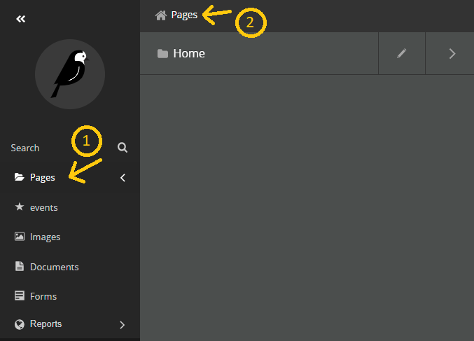
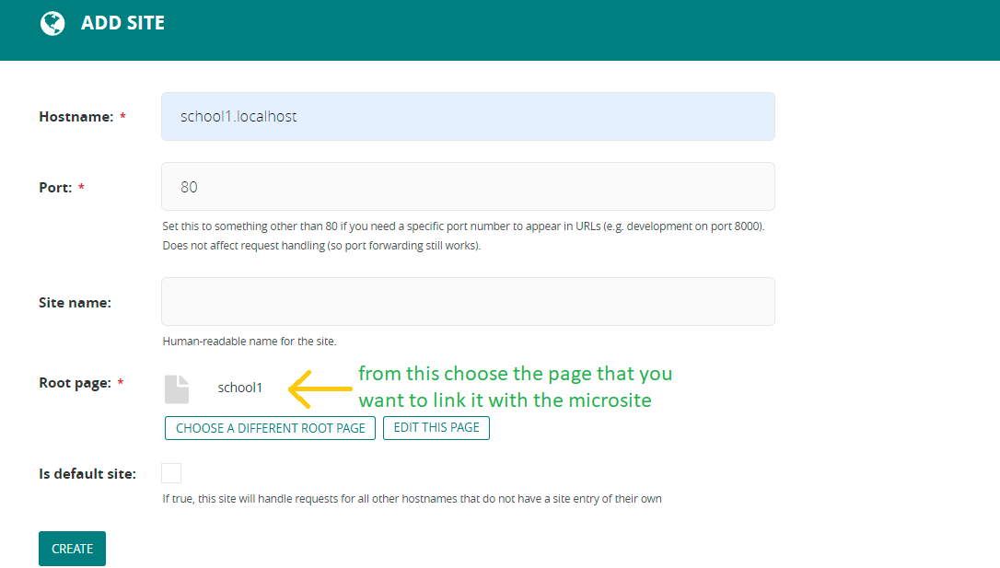

## adding new subdomain website 

***first you have to make a school page in the root***

1- go to pages option in the sidebar 

2- in the pages section go to pages.(to go to the root page)

3- click add a child page 

4- select the school home page option 

5- fill the nessesary information 

6- click on the arrow near save draft below and select publish to complete your page 

***now, time to add a microsite for the school page***

7- go to the settings in the side navbar 

8- select sites 

9- click on add a site 

10- in the host name you should put subdomain_name.website_name eg: asac.localhost

11 - in the port fill the port that your website run on 

12 - in the root page select the page that you want to make in the home page for your subdomain (in this example you should use the schools home page that you did in step 3 to 6)

13 - now create the micro site 

you can now go to subdomain_name.website_name domain:port_number and find your website up and running. (for example: http://school1.localhost:8000) :D 

