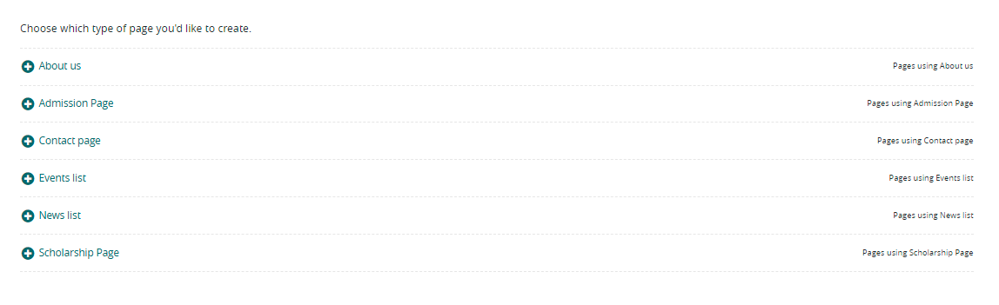

# adding pages

to add page to your website 

***for example add a scholarship page (as a child page) into the school page***

1- you should go to pages in the sude nav 

2- click on your website 

3- choose add child page 

4- select the type of page you want 

- [about us page](documents/pages/about_us_page.md)
- [addmission page](documents/pages/addmission_page.md)
- [contact us page](documents/pages/contact_us_page.md)
- [news and events page](documents/pages/news_and_events_page.md)
- [scholarship page](documents/pages/scholarship_page.md)

 

 

