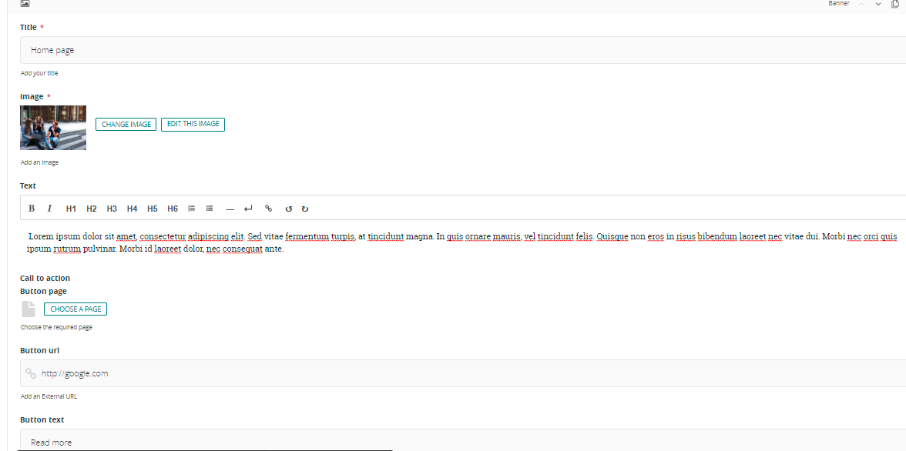
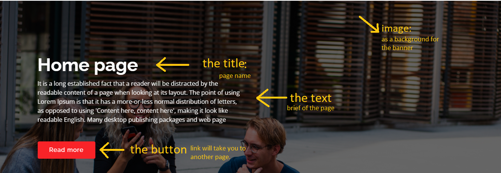
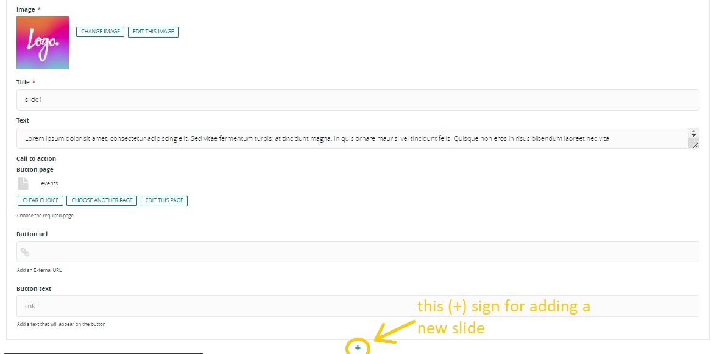
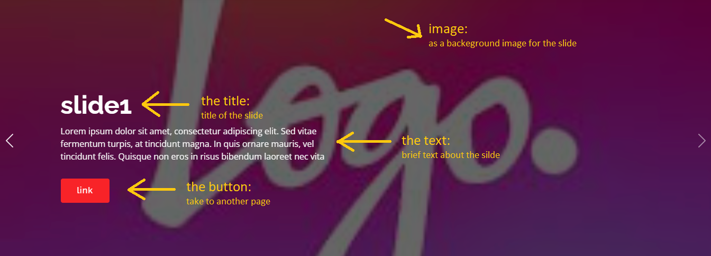
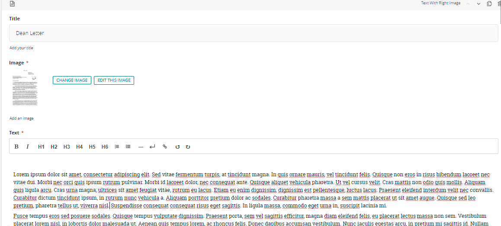
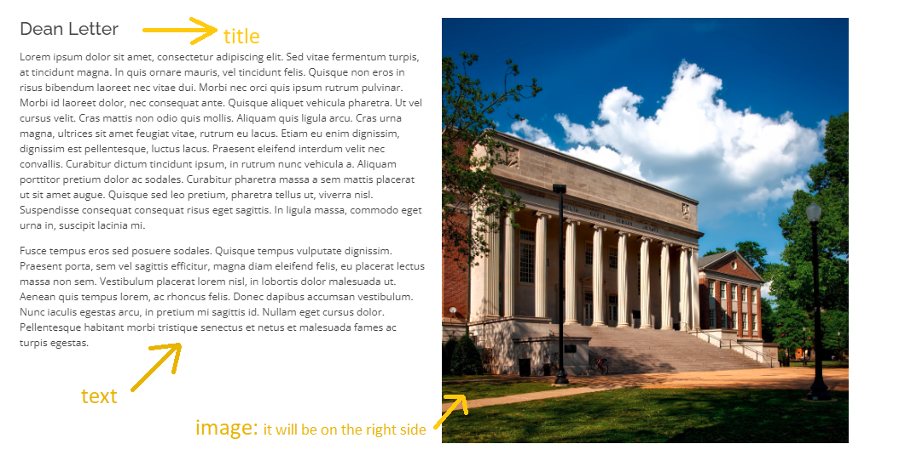
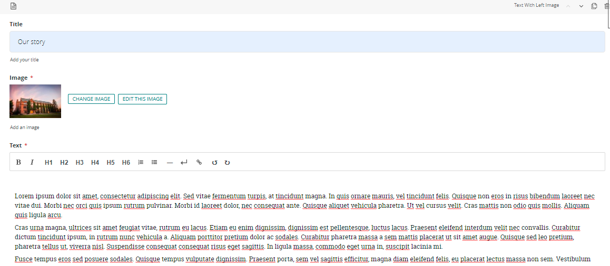
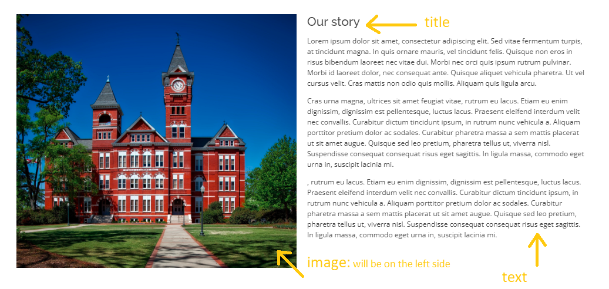

# block types

- [banner block](#banner-block)
- [slider block](#slider)
- [text with right image](#text-with-right-image)
- [text with left image](#text-with-left-image)
- [cards](#cards)
- [youtube video id](#youtube-video-block)

## Banner Block

it is a component that will appear at the beginning of the site and it will contain the title/header of the site and a small breif about it

1- in the title field write the headline that you want it to appear as a title above the image 

2- in the image field click on choose image and you can either upload image from your device or choose from the existing images (this will be the landscabe background image of the banner)

3- in text field you can write a brief description about the topic 

4- in call to action field you can either choose a page from Button page or add a link to Button URL

5- in te button text you can add the text that you want your link to be embedded in

**Example: how to fill banner fields**

**Example: how it will look like**

## Slider

the slider is a component that contain images that will slide to show all the images.

1- in the image field click on choose image and you can either upload image from your device or choose from the existing images (this will be the background image of the slide) 
 
2- in the title field you can but the title of the slide

3- in the text field you can add description for the slide

4- in call to action field you can either choose a page from Button page or add a link to Button URL

5- in te button text you can add the text that you want your link to be embedded in

notes : 

- to add more slides you can click in the ( + ) sympole above or below the current 
slide 

- also you can order then by the ( ^ ) and or the down arrow 

**Example: how to fill slider fields**

**Example: how it will look like**

## Text with Right Image

this component contain a big picture in the right side and a text in the left side 

1- in the title field you can but the title of the section

2- in the image field click on choose image and you can either upload image from your device or choose from the existing images (this will be the right)

3- in text field you can write a brief description about the topic 

**Example: how to fill text with right image fields**

**Example: how it will look like**

 ## Text with Left Image

this component contain a big picture in the left side and a text in the left side 

1- in the title field you can but the title of the section

2- in the image field click on choose image and you can either upload image from your device or choose from the existing images (this will be the left)

3- in text field you can write a brief description about the topic 

**Example: how to fill text with left image fields**

**Example: how it will look like**

## Cards 

1- in the title of cards section put the title of the section 

2- inside the card element fill the following  

    - in the image field click on choose image and you can either upload image from your device or choose from the existing images (this will be the card image)

    - in the title field put the title of the card 

    - in the text field put the description of the card 

    - in call to action field you can either choose a page from Button page or add a link to Button URL

    - in te button text you can add the text that you want your link to be embedded in
 
notes : 

- to add more cards you can click in the ( + ) sympole above or below the current 
card 

- also you can order then by the ( ^ ) and or the down arrow 

## Youtube Video Block 

this block shows a youtube video in the same website

1- in the title field add the title of the section 

2- in video id field add the video id from youtube

    - you can find the video id by going to the video in youtube  and in its link there in a v={video_id} copy the id and the past it in this field 

3- in text field you can write a brief description about the topic 

