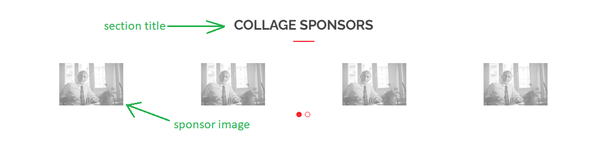

# block types

- [Banner block](#banner-block)
- [Slider block](#slider)
- [Text with right image](#text-with-right-image)
- [Text with left image](#text-with-left-image)
- [Cards](#cards)
- [Youtube video block](#youtube-video-block)
- [Infographic counter block](#infographic-counter-block)
- [Sponsors Block](#sponsors-block)
- [Schools and faculties](#schools-and-faculties)
- [FAQ's](#faq)
- [Addmission](#addmission)

## Banner Block

it is a component that will appear at the beginning of the site and it will contain the title/header of the site and a small breif about it.

1- in the title field write the headline that you want it to appear as a title above the image.

2- in the image field click on choose image and you can either upload image from your device or choose from the existing images (image will be the landscabe background of the banner).

3- in text field you can write a brief description about the topic/site.

4- in call to action field you can either choose a page from Button page or add a link to Button URL.

5- in te button text you can add the text that you want your link to be embedded in. for example: Read more.

**Example: how to fill banner fields via a Button URL field**

**Example: how to fill banner fields via a Button page field**

**Example: how it will look like**

## Slider

the slider is a component that contain images that will slide to show all the images.

1- in the image field click on choose image and you can either upload image from your device or choose from the existing images (image will be the background of the slide). 
 
2- in the title field you can add the title of the slide.

3- in the text field you can add description for the slide.

4- in call to action field you can either choose a page from Button page or add a link to Button URL.

5- in te button text you can add the text that you want your link to be embedded in. for example: Read more.

### notes : 

- to add more slides you can click in the ( + ) sympole below the current. 
slide.

- also you can order them by the ( ^ ) and or the down arrow.

**Example: how to fill slider fields**

**Example: how it will look like**

## Text with Right Image

this component contain a big picture in the right side and a text in the left side.

1- in the title field you can add the title of the section.

2- in the image field click on choose image and you can either upload image from your device or choose from the existing images.

3- in text field you can write a brief description about the topic.

**Example: how to fill text with right image fields**

**Example: how it will look like**

 ## Text with Left Image

this component contain a big picture in the left side and a text in the left side. 

1- in the title field you can add the title of the section.

2- in the image field click on choose image and you can either upload image from your device or choose from the existing images.

3- in text field you can write a brief description about the topic.

**Example: how to fill text with left image fields**

**Example: how it will look like**

## Cards 

1- in the title of cards section put the title of the section.

2- inside the card element fill the following:

- in the image field click on choose image and you can either upload image from your device or choose from the existing images (this will be the card image).

- in the title field put the title of the card itself, mainly the name of the person (if you use it as Our Staff section).

- in the text field put the description of the card, mainly a small brief about that person (if you use it as Our Staff section).

- in call to action field you can either choose a page from Button page or add a link to Button URL, mainly a link for the linkedin account or any social media accounts (if you use it as Our Staff section).

- in te button text you can add the text that you want your link to be embedded in.

**Example: how to fill card block fields**

**Example: how to it will look like**

## notes : 

- to add more cards you can click in the ( + ) sympole above or below the current 
card.

- also you can order them by the ( ^ ) and or the down arrow. 

## Youtube Video Block 

this block shows a youtube video and a small brief about it.

1- in the title field add the title of the section.

2- in video id field add the video id from youtube.

- you can find the video id by going to the video in youtube and in its link there in a v={video_id} copy the id and the past it in this field. 

3- in text field you can write a brief description about the topic.

**Example: how to fill youtube video block fields**

**Example: how it will look like**

## Infographic counter block 

this section can represent the numbers you want to show in the website. for example: number of graduates ...etc. 

this section contain an icon and number beneath it.

1- in the title field put the title of your section (eg: our numbers).

2- filling info(Infograph) section : 

- in Icon Code field you should put the icon code you want by:

    - go to [bootstrap](https://icons.getbootstrap.com/).

    - then choose the icon tab, and choose the icon you want, in the icon font section there is a code looks like this `<i class="bi bi-align-alarm-fill"></i>`

    - copy the text after the first `bi` inside class eg :`bi-align-alarm-fill`, and paste it in the field. 

- in the title you should put the title/name that the number related to, eg: our graduate. 

- in the number section you should write a number for that title/name, eg: 10000.

 **Example: how to fill infographic block fields**

 

 **Example: how to it will look like**

 

### notes : 

- to add more Infograph you can click in the ( + ) sympole above or below the current 
Infograph.

- also you can order them by the ( ^ ) and or the down arrow. 

- you can't add more than one Infographic counter block in the same page.

## Sponsors Block

this section is to show the sponsors of the institute, this section contains of a title of section and several images align horizantally below it.

1- in the title field fill the title that you want to appeare as a headline above the pictures eg: our sponsors. 

2- in Sponsors section : 
 
- in the image field click on choose image and you can either upload image from your device or choose from the existing images (this will be the card image).

**Example: how to sponsors block fields**

**Example: how it will look like**

### notes : 
- to add more sponsors you can click in the ( + ) sympole above or below the current sponsor.

- also you can order them by the ( ^ ) and or the down arrow. 

- you can't add more than one sponsors block in the same page.

## Schools and faculties 

this section contains a title ot the section with several cards below it. 

***important note*** : to fill this section you should already have a school page ethier seperatly or on this project, to see how to make your schools website go to [this link](./adding_new_subdomain.md).

1- in the title field write a title for the whole section, eg : our schools.

2- in the Summary field you can write a brief description of the whole section. 

3- in boxes section do thw following: 

- in logo field click on choose image and you can either upload image from your device or choose from the existing images (this will be the card image).

- in title write the schools name that you want.

- in the summary field write a very brief description about that school.

- in call to action field you can either choose a page from Button page or add a link to Button URL.

- in te button text you can add the text that you want your link to be embedded in. for example: Read more.

**Example: how to fill schools and faculities block**

**Example: how it will look like**

### notes : 
- to add more school you can click in the ( + ) sympole above or below the current school. 

- also you can order them by the ( ^ ) and or the down arrow.

## FAQ

**Example: how to fill FAQ's block**

**Example: how it will look like**

### notes : 
- to add more questions you can click in the ( + ) sympole above or below the current question. 

- also you can order them by the ( ^ ) and or the down arrow.

## Addmission

**Example: how to fill addmission block**

**card section inside addmission block**

**Example: how it will look like**

### notes : 
- to add more card in addmission you can click in the ( + ) sympole above or below the current card. 

- also you can order them by the ( ^ ) and or the down arrow.

## VR Tour

**Example: how to fill VR-tour block**

**Example: how it will look like**

## Social Media Block And
## Location Google Map Block

**Example: how to fill social media block**

**Example: how to fill google map location block**

**Example: how it will look like**

### notes : 
- to add more socail media or locations you can click in the ( + ) sympole above or below the current social media or location. 

- also you can order them by the ( ^ ) and or the down arrow.

## Embedded Links

**Example: how to fill Embedded links block**

**Example: how it will look like**

### notes : 
- to add more links you can click in the ( + ) sympole above or below the current link section. 

- also you can order them by the ( ^ ) and or the down arrow.

