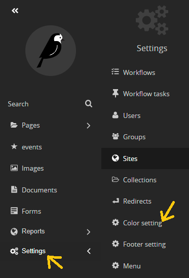
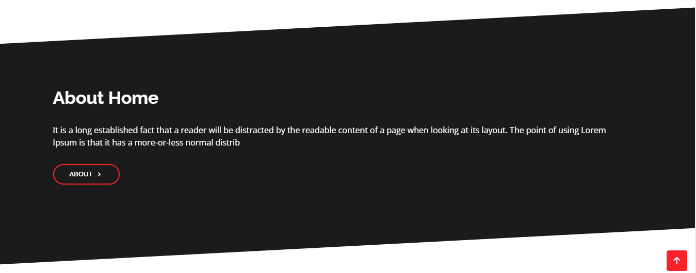
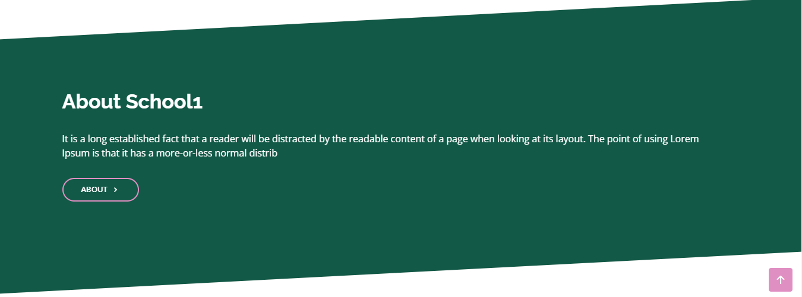

# change navbar and footer theme

1- go to the settings in the side nav 

2- choose color setting

3- in color setting you can find a dropdown list in the top that is your main website by default.

4- from this dropdown list choose the subdomain that you want to change the theme of.

5- now fill the color fields below 

- footer theme color: 
    - footer background color
    - footer small section color: the small footer that at the end of the page.
    - text font color: the text color.
    - footer link hover color: this color will appear when you hover over a link.
    - underlines color: color for underline, dot, social icons and go-up arrow icon inside the small footer section.

- navbar theme color:
    - navbar background color
    - link font color: font color for links
    - navbar link hover color: this color will appear when you hover over a link.

- **note:** you can fill the colors either by HEXA color(for example: #7D1E6A) or you can click in the colored Squair and choose the color you like.

6 - save the changes

now you can go to your website and see the changes  :D 

**for example: 2 microsites have there own colors (about section)**

