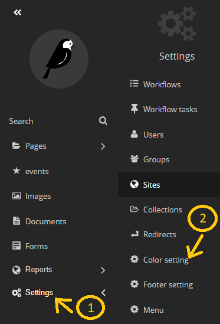

# change theme for your website 

1- go to the settings in the side nav 

2- choose color setting

3- in color seeting you can find a droup dowm list in the top that is your main website by default 

4- from this drop doun list choose the subdomain that you want to change the theme of.

5- now fill the color fields below 
- theme color1 represent the circles and lines in the current design 

- background color represent the cards background color and the background of the footer 

- you can fill the colors either by hexa color or you can click in the colored squair and choose the color you like

6 - save the changes

now you can go to your website and see the changes  :D 

**for example: 2 microsites have there own colors (about section)**

