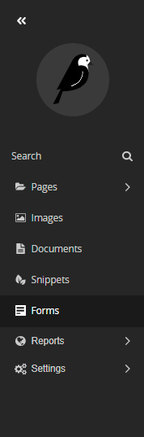
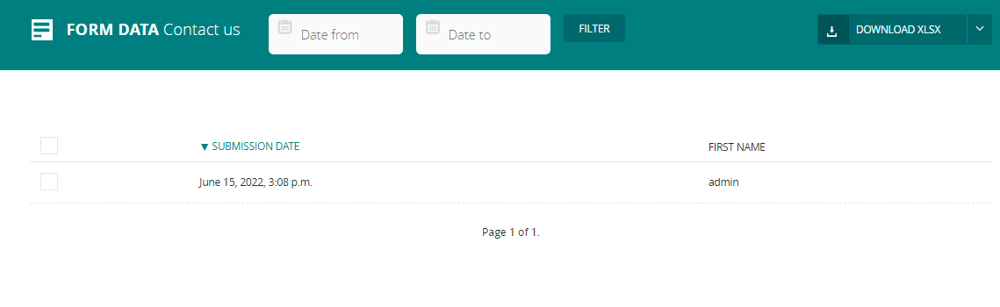

# form builder
enable you to add a form into your page. to use it as you want.

for example: [contact page](documents/pages/contact_us_page.md) has field called form fields to add multi and different fields into your page.

in user-side after submit a form it will direct you to a thank_you_page or a success_submit_page, in admin side a **Forms** tab will appear in left navbar. this place to tract your forms and you will see what is the submitted data for each form.

you can filter the data by date, and you can download the data record as csv file or xlsx file.

