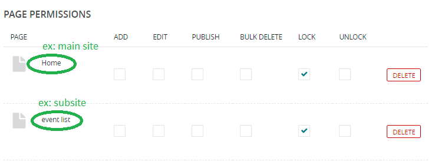

# lock a page
used to grant the ability to lock or unlock a page (and any pages underneath it) for editing, preventing users from making any further edits to it.

if you lock a page for a user/group they can see it but can not edit it.

## so, how to add this permission into a site.
1. you should add a [group](./user_managment.md#adding-groups ) and add this permission for a site/subsite.

2. add a [user](./user_managment.md#adding-users) then, add a role by select the group.

*now when user login, he/she can view the locked pages but cannot edit or delete it*

<h4 style="color:red">important notes</h4>

in the same group:
- if you locked the main page but add `Edit` permission into a subpage from this main page it will work fine.
- but if you make the opposite(locked the sub and edit the main) it will not work, you will be able to edit the sub page ☹ 

