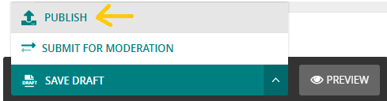

# Admission page
- title is required, to fill the content, notice that there are many block types and you can find its description [here](documents/block_types.md).

- for programs block: fill the title of the entire section(for example: Our Programs), then fill for each program: name, image, details and either an external URL by 'button URL field' or an internal program detail page by 'button page field'. finally, the text of the button. 

<h4 style="color:red">important notes</h4>
if the program is from an external website you should add it as 'button URL field'.

and if the program is from your site (internally) you should do the following:
- first, keep the 'button URL field' and 'button page field' empty. and don't forget to save the page by SAFE DRAFT.

- second, add a child page into the admission page (its called [program detail page](documents/pages/program_details_page.md)).
- add your program detail information the inside program detail page, and publish it.

- third, go back to admission page, and edit the program block by adding a 'button page field' and choose the program detail page that you created.
- finally, now you can publish admission page.

***example what admission page will look like***

here the intel program is from external website so I added as a 'button URL', for python program is from the site it self it you click on more details. so it will look like this:

***example what program detail page will look like***

now you have an admission page in your website :D 
