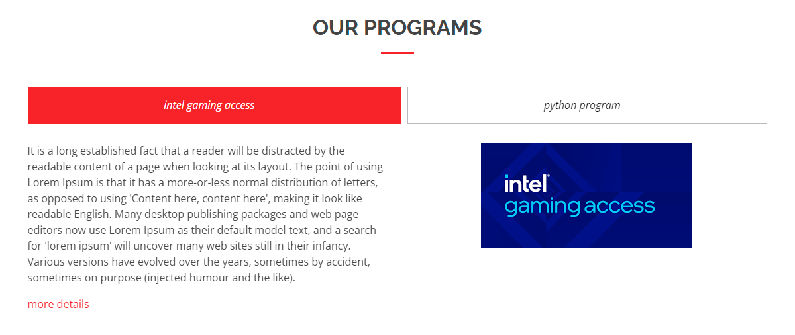

# add an Addmission page
- title is required, to fill the content is similar of the content inside about us page at first step.

- for programs block: fill the title of the entire section(for example: Our Programs), then fill for each program: name, image, details and either an external url by 'button url field' or an internal program detail page by 'button page field'. finally, the text of the button. 

### important note:
if the program is from an external website you should add it as 'button url field'.

and if the program is from your site (internally):
- first, keep the 'button url field' and 'button page field' empty. and dont forget to save it.

- second, add a child page into the addmission page (its called [program detail page](./program_details_page.md)).
- add your program info, and publish it.

- third, go back to addmission page, and edit the program by adding a 'button page field' and choose the program detail page that you created.
- finally, now you can publish addmission page.

here the intel program is from external website so i added as a 'button url', for python program is from the site it self it you click on more details. so it will look like this:

now you have an addmission page in your website :D 
