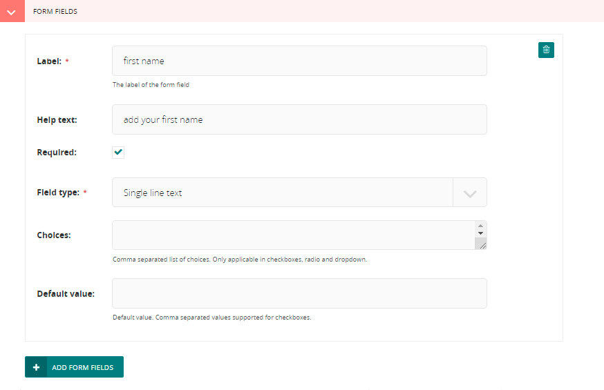
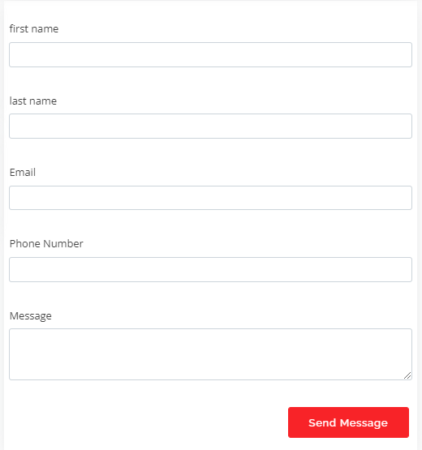
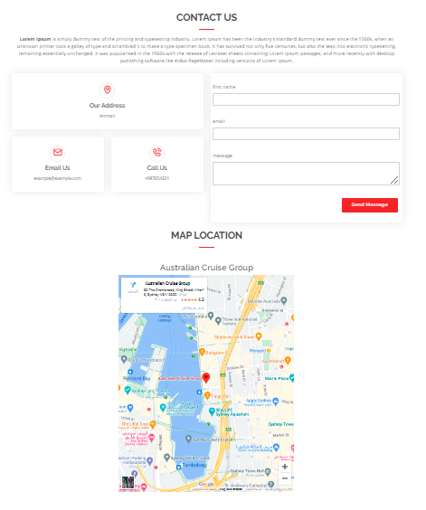

# add a Contact us page:

- the title, intro and thank you message are required field (you have to fill it)

- to add address in the adress field click on add adress button then fill your company address.(notice that you can add more than address if your company have branchs, so you can also add branchs address).

- email and call us fields are the same of address.

- to add a google maps link  you should click on google maps button and then fill the place id and the name of the location

- form field: contact us page have a form that user has to fill it. for example:

**and it will look like this:**

**whole page will be as this**

- **dont forget to publish it.**

now you have a contact us page in your website :D 
