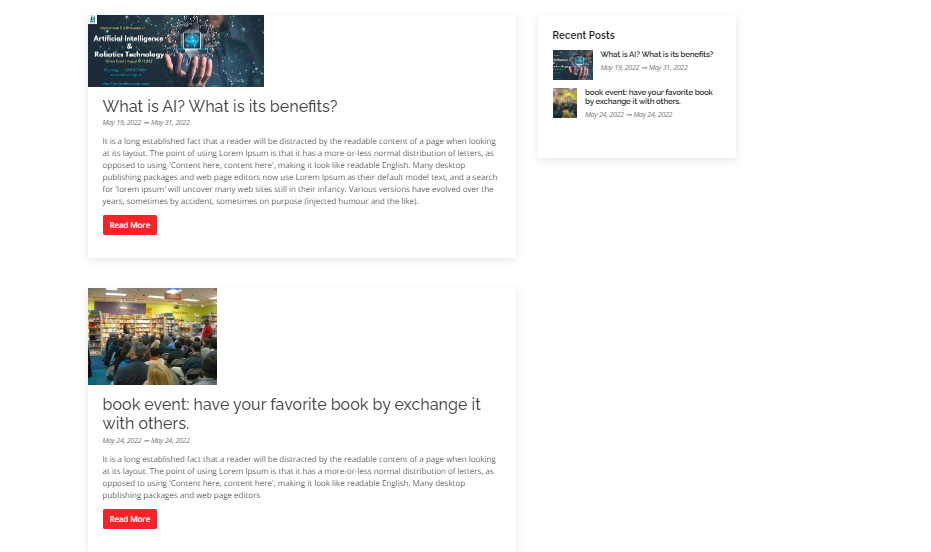

# Events list page
- this page is a listing page, which means that it holds all the [events detail pages](documents/pages/event_detail_page.md).
- title and banner are required fields.
- publish it.

**now is the time to add a event details page, by add a child page to events list page called: [Event details](documents/pages/event_detail_page.md)**

after adding event details page, the event details section will look like this:

<h4 style="color:red">important note</h4>
you can filter the events by the school name, start date, end date, by 2 of them, or by all of them.
  
  

now you have events list page in your website :D 
