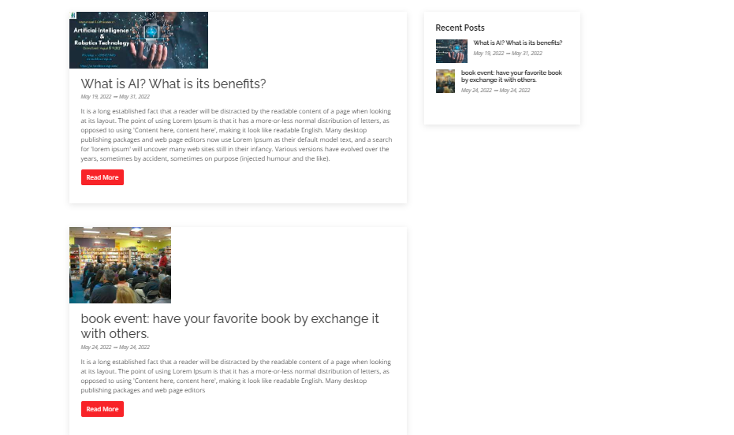

# add a News and Events page
- this page is a listing page, which means that it holds all the events and news.
- title and banner are required fields.
- publish it.

**now is the time to add a event/news details page, by add a child page to news and events page called: [News details](./news_details_page.md)**

after adding news details page, the news details section will look like this:

now you have news and events list page in your website :D 
