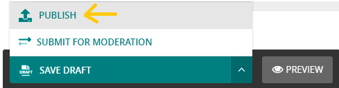

# add a News Details page
- it is a page that will hold a more details for the event/news
- title, start date, end date and banner are required.
- fill the content.
- publish it.

now you have a news details page in your website :D 

