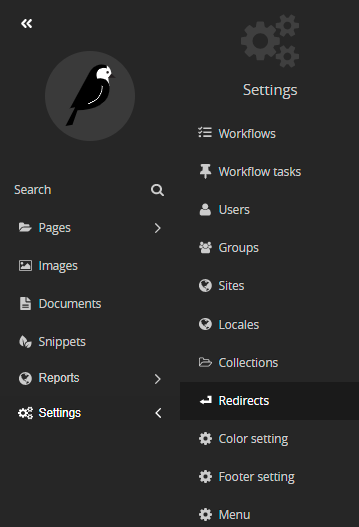
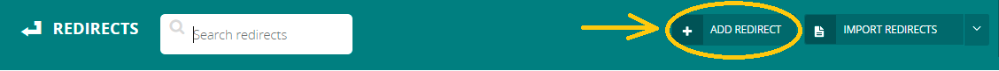
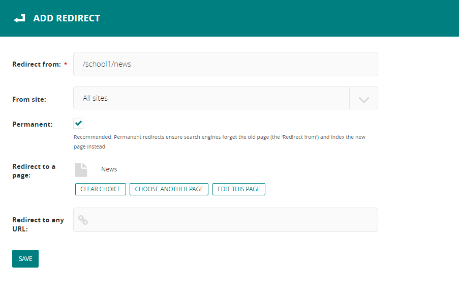

# Re-direct
A redirect used to ensure that when a page is no longer available, the visitor and search engines are sent to a new page.

**to go to the redirect section:**

- in admin side --> go to settings --> go to redirects

- to add a redirect: click on ` ADD REDIRECT` button.
*here you can search for the existing redirects*

*an example of how to add a redirect*

**which:**

1. redirect form: the URL which is no longer available on your site. 
2. From site: this option to select which site this redirect will be add (the default option if you don't have a microsites/subdomains in your project will be your site, but if you have it will be a dropdown list to select which site you want to implement this redirect to).
3. Permanent: ensure search engines forget the old page (that in 'Redirect from' field) and index the new page instead.
4. Redirect to a page: the new page that will redirect to it. (internal page)
5. Redirect to any URL: the new page that will redirect to it. (external page)

- finally, click on `SAVE` button.

<h4 style="color:red">important notes</h4>

- Keep in mind a redirect will only be happened if the page is not found. It will not be applied to existing pages that your site have/create it.
- if you add a [localization](documents/localization.md) into your site, your `redirect form` field will be like this: for example `/en/news` or `/ar/about`.
